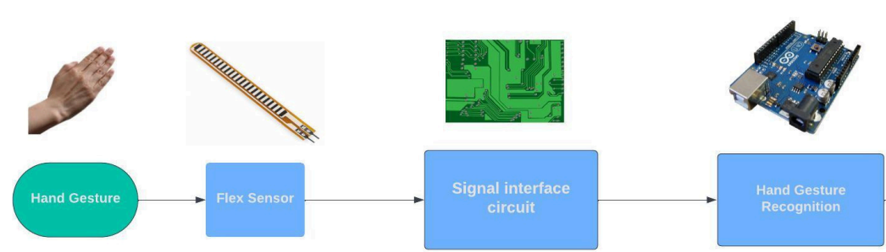

## Hand Gesture Recognition Using Flex Sensors
In this project let us see how to design and Implement a circuit to measure the amount of bending/deflection. Using the same implement the system for recognition of Hand gestures.
##Components used : 
1)Flex Sensors 
2)Resisitors 
3)Connecting wires 
4)I2C Module 
5)Arduino Uno 
6)LCD Display. 
## What is flex Sensor :
Flex sensors change resistance when bent or flexed. It uses resistance changes to monitor bending on a flexible substrate with conductive materials. Flex sensors accurately sense human movements in gesture control interfaces, prosthetics, and robotics, providing intuitive engagement and inventive solutions. 
FS-L-0095-103-ST: 
Flat resistance-10kΩ 
Resistance tolerance-±30% 
Bend resistance range20kΩ to 110kΩ 
Power rating-0.50 Watts 
continuous. 1 Watt Peak 

## Working Principle :
For measuring the degree of bending to detecting hand gestures.Flux sensors are affixed to the fingers and measurements are obtained when the fingers are flexed. The flex sensor functions as a variable resistor, we may obtain readings from it by employing a basic voltage divider.Interfacing the sensor with the voltage divider circuit, which is connected to the Arduino micro controller. Flex the sensor within a range of 0 to 90 degrees and record the corresponding output voltage. Determine the resistance of the flex sensor based on the relationship between voltage and resistance. 

##Block Diagram :

##Implementation :
The experiment utilizes three flex sensors, one affixed to the index finger and the other two fingers.Since we have three sensors, we used only four signs: 
1. Each finger flat on the ground—"Three" 
2. Curled inside ring finger and flat other two – "Two" 
3.Curled inside ring finger,middle finger,flat index finger – "One" 
4.All three fingers curled inside-”Zero” 
The resistance of the each flex sensor increases when we curl the
respective finger. 
##Block Diagram :

##Observations and conclusions:
A linear connection between the resistance levels and the bending was discovered. The sensor's resistance varies even with very little bending. It takes some time for the resistance to return to its flat resistance value once it has been bent. Occasionally, the deformation of the flux sensor (because the sensor was too thin) prevents the resistance from returning to the flat resistance values. It was challenging to get the results to be repeatable. This might lead to a measurement inaccuracy for the bending.
